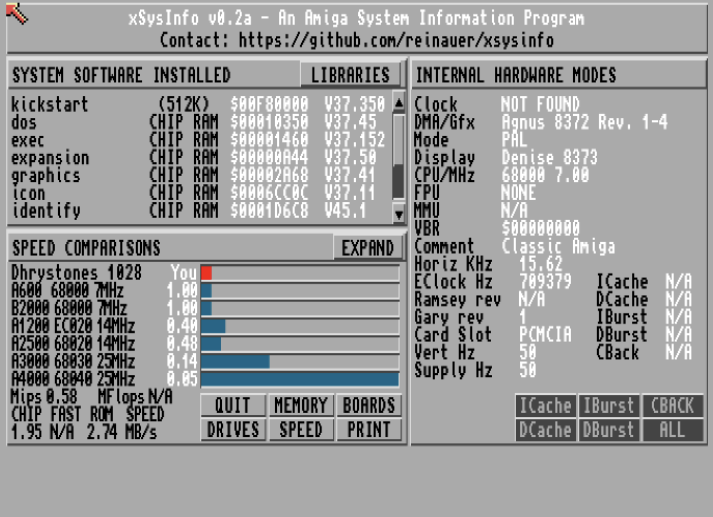
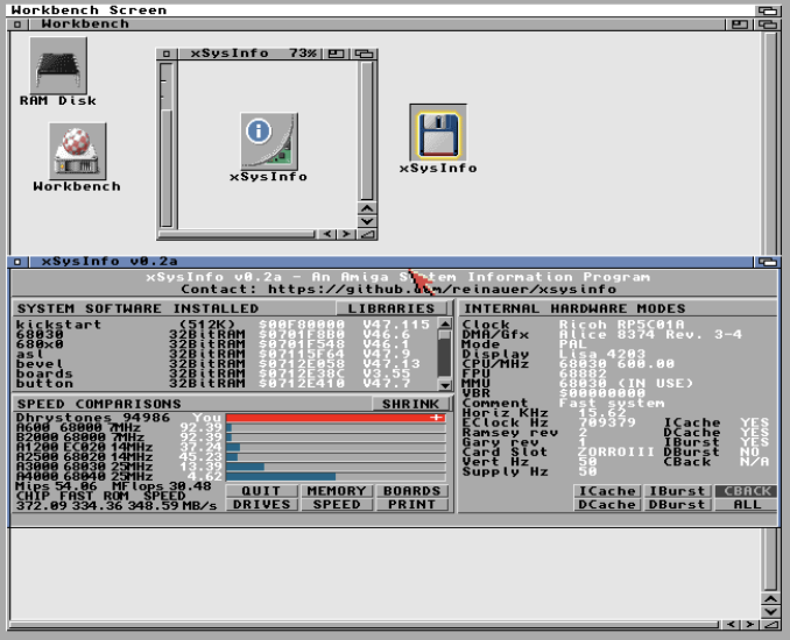

# xSysInfo



`xSysInfo` is a comprehensive system information utility designed for AmigaOS. It provides detailed insights into your Amiga system's hardware and software configuration, along with benchmarking capabilities.

**Note:** This program does not contain any code from the original AmigaOS SysInfo tool.

## Features

*   **Detailed Hardware Information**: Get in-depth reports on your CPU, memory, drives (including SCSI), expansion boards, and cache.
*   **Software Environment Overview**: View details about your AmigaOS software setup.
*   **Benchmarking**: Includes Dhrystone benchmarks to assess your system's performance.
*   **Graphical User Interface (GUI)**: User-friendly interface for easy navigation and information display.
*   **Printing Support**: Print out system reports for documentation or sharing (For now, the output is saved to a file in RAM:)
*   **Localization**: Supports multiple languages for its interface.

## Building `xSysInfo`

To build `xSysInfo`, you will need a GCC cross-compiler for m68k-amigaos (e.g., `m68k-amigaos-gcc`). The build process also requires `make`, `curl`, `md5sum`, and `lha` to handle external dependencies.

1.  **Clone the repository**:
    ```bash
    git clone https://github.com/reinauer/xsysinfo.git
    cd xsysinfo
    git submodule update --init
    ```

2.  **Build the project**:
    The Makefile will automatically handle fetching and building necessary third-party libraries (`flexcat` and `identify`).
    ```bash
    make
    ```

3.  **Create an Amiga Disk File (ADF)**:
    You can create a bootable `.adf` image containing `xSysInfo` and its necessary libraries using `xdftool`.
    ```bash
    make disk
    ```
    This will generate `xsysinfo-<version>.adf` in the project root.

## Running `xSysInfo`

The primary way to run `xSysInfo` on a real Amiga is via a GOTEK drive using the generated `xsysinfo-<version>.adf` disk image.

You can also run the ADF on an Amiga emulator (like WinUAE or FS-UAE).

Additionally, the `xsysinfo` binary itself can be executed directly from the shell on a real Amiga or emulator.

## Configuration

You can select whether xSysInfo is started in a window or on its own screen
by specifying a DISPLAY ToolType. DISPLAY=auto is the default and will select
window when your screen resolution is larger than 640x512, as xSysInfo is
assuming RTG mode. For lower resolutions it will start on a PAL or NTSC screen.
You can force either behavior with DISPLAY=window or DISPLAY=screen.




## Dependencies

`xSysInfo` utilizes the following third-party projects:
*   **FlexCat**: For catalog and localization file handling. (https://github.com/adtools/flexcat)
*   **Identify**: For identifying various hardware components, including PCI devices. (https://codeberg.org/shred/identify)
*   `openpci.library`: For PCI device access.
*   **fd2pragma**: Tool to create header files with pragma statements. (https://github.com/adtools/fd2pragma)

## Contributing

We welcome contributions! Please feel free to fork the repository, make your changes, and submit a pull request.

